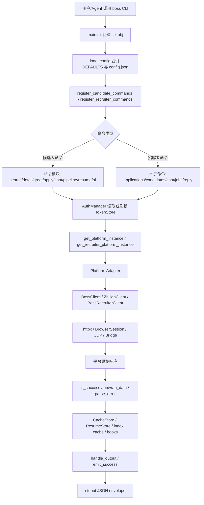
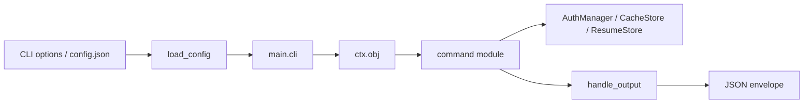
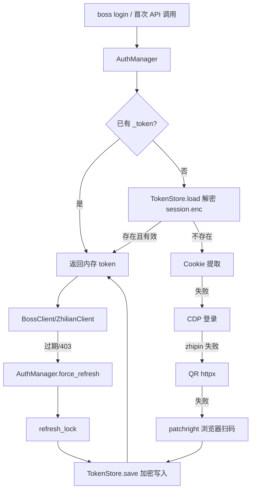
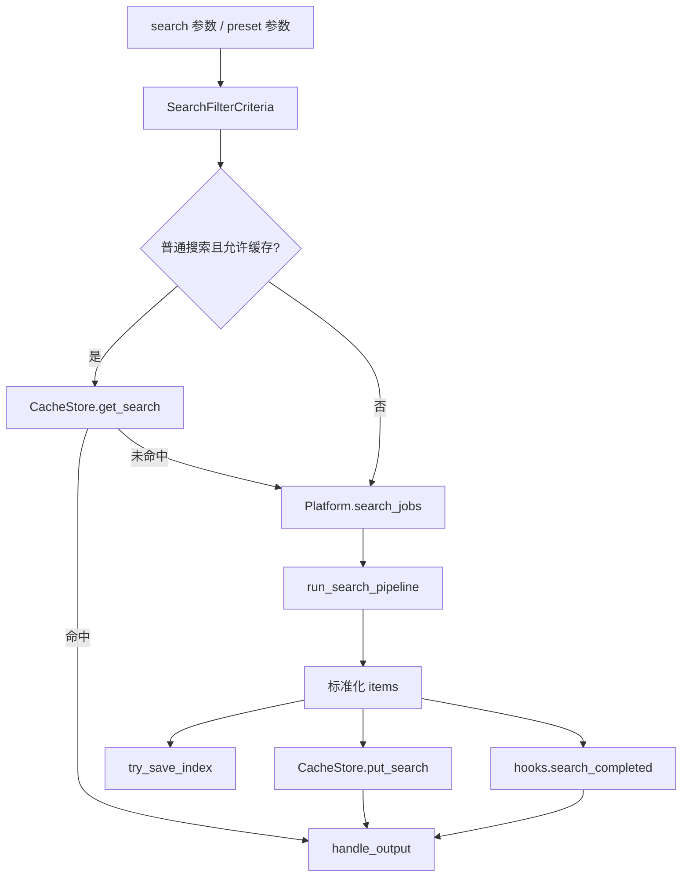
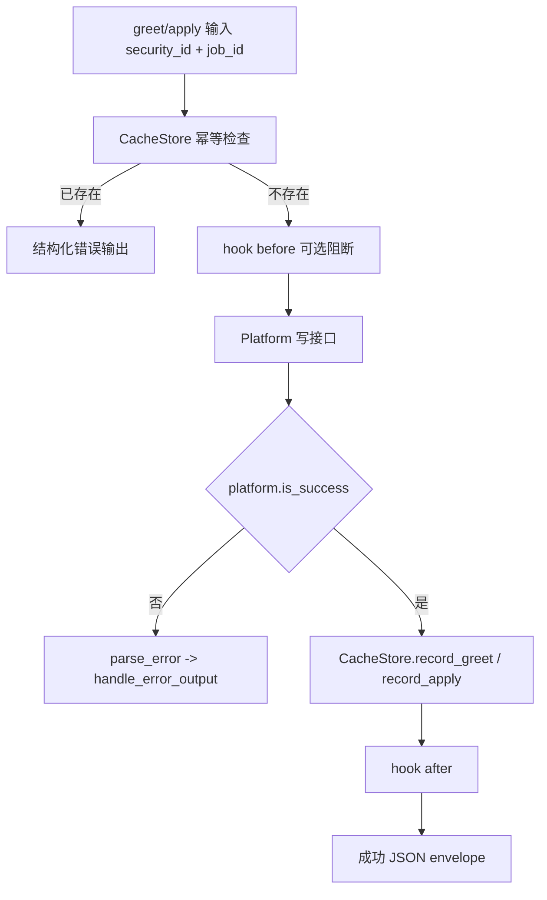
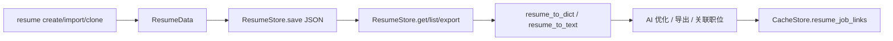
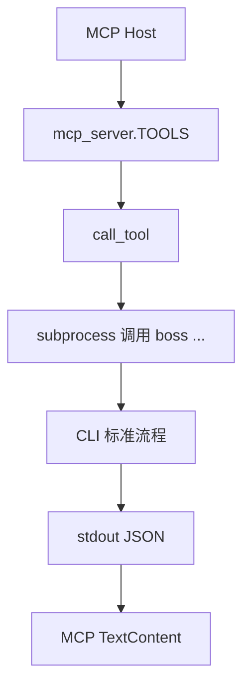

# boss-agent-cli 全景变量分析

> 本文件由 `code-plan` 技能第一阶段生成，只覆盖 `analysis.md`。它是项目状态、配置、缓存、平台响应和命令上下文的 Single Source of Truth 维护基准；后续 PR 增删改字段时必须同步更新受影响行。

## 1. 项目流程概览

`boss-agent-cli` 是一个面向 AI Agent 的招聘平台双端 CLI。用户通过 `boss` 命令进入 Click 主入口，主入口解析全局配置与运行上下文，然后按命令分发到求职者或招聘者工作流。命令层不直接绑定具体招聘平台，而是通过 `Platform` / `RecruiterPlatform` 抽象实例化 BOSS 直聘或智联招聘客户端；客户端负责认证、请求节流、平台接口调用和响应包络解析；命令最终统一通过 JSON envelope 输出。

主流程如下：



典型求职者搜索流程：`search_cmd` 读取 `ctx.obj`、预设与筛选参数，构造 `SearchFilterCriteria`，打开 `CacheStore`，命中缓存则直接输出；否则创建 `AuthManager` 和平台实例，调用 `run_search_pipeline` 获取职位列表，必要时逐条查询详情做福利筛选，然后保存 index/cache 并输出 JSON。

典型写操作流程：`greet_cmd` 先用 `CacheStore.is_greeted` 做本地幂等保护，再触发 `hooks.greet_before`，调用 `platform.greet`，成功后写入 `greet_records` 并触发 `hooks.greet_after`。`apply_cmd`、`shortlist`、`resume` 等命令采用类似的“上下文 -> 认证 -> 平台/本地存储 -> 输出”路径。

## 2. 项目结构概览

```text
boss-agent-cli/
├─ pyproject.toml                 # 包元数据、入口 boss/boss-mcp、ruff/mypy/pytest 配置
├─ README.md / README.en.md       # 用户文档、命令流程、平台能力说明
├─ docs/                          # 用户/平台/Agent 集成文档
├─ doc/                           # code-plan 维护产物目录，本文件位于此处
├─ mcp-server/server.py           # 兼容包装入口，转发 src 内 MCP 实现
├─ scripts/                       # smoke/probe 等辅助脚本
├─ tests/                         # pytest 测试，覆盖命令、平台、认证、缓存、schema 等
└─ src/boss_agent_cli/
   ├─ main.py                     # Click 主入口，创建 ctx.obj 并注册命令
   ├─ config.py                   # DEFAULTS 与 config.json 合并
   ├─ output.py                   # JSON envelope、敏感字段脱敏、stderr logger
   ├─ display.py                  # TTY/JSON 输出适配与错误契约
   ├─ hooks.py                    # search/greet 等扩展钩子
   ├─ pipeline_state.py           # 求职流水线派生状态
   ├─ index_cache.py              # 搜索结果编号缓存，用于 show 等回看
   ├─ search_filters.py           # 搜索筛选条件、福利筛选流水线
   ├─ match_score.py              # 职位匹配评分
   ├─ digest.py / chat_summary.py # 汇总与沟通摘要
   ├─ mcp_server.py               # MCP 工具定义与 boss 子进程调用
   ├─ commands/                   # CLI 命令层
   │  ├─ register.py              # 顶层命令与 hr 子命令注册
   │  ├─ _platform.py             # 候选人平台实例化
   │  ├─ _recruiter_platform.py   # 招聘者平台实例化
   │  ├─ search.py/greet.py/...   # 候选人命令实现
   │  └─ recruiter/               # 招聘者命令实现
   ├─ platforms/                  # Platform / RecruiterPlatform 抽象与注册表
   │  ├─ base.py                  # 候选人平台接口契约
   │  ├─ recruiter_base.py        # 招聘者平台接口契约
   │  ├─ zhipin.py                # BOSS 求职者适配器
   │  ├─ zhilian.py               # 智联求职者适配器
   │  └─ zhipin_recruiter.py      # BOSS 招聘者适配器
   ├─ api/                        # 平台 HTTP/浏览器客户端与响应模型
   │  ├─ client.py                # BOSS 求职者客户端
   │  ├─ recruiter_client.py      # BOSS 招聘者客户端
   │  ├─ zhilian_client.py        # 智联客户端
   │  ├─ browser_client.py        # Browser/CDP/Bridge 请求通道
   │  ├─ endpoints.py             # BOSS URL、枚举码、headers
   │  ├─ endpoints_loader.py      # 外部 endpoint spec dataclass
   │  ├─ models.py                # JobItem / JobDetail dataclass
   │  └─ throttle.py              # 请求节流
   ├─ auth/                       # 登录态生命周期
   │  ├─ manager.py               # 登录、刷新、状态检查
   │  ├─ token_store.py           # 加密 session.enc、salt、refresh.lock
   │  ├─ browser.py/qr_login.py   # 浏览器/CDP/QR 登录链路
   │  └─ cookie_extract.py        # 浏览器 Cookie 提取
   ├─ cache/store.py              # SQLite 本地状态与缓存
   ├─ resume/                     # 简历模型、JSON 存储、导出与模板
   ├─ ai/                         # AI 配置与 OpenAI-compatible 调用
   └─ bridge/                     # 浏览器扩展桥接协议与 daemon/client
```

## 3. 核心状态容器

| 字段名 | 类型 | 生成节点 | 消费节点 | 流转说明 | 约束条件 |
|---|---|---|---|---|---|
| `config.DEFAULTS.default_city` | `str | None` | `config.DEFAULTS` | 命令默认值/配置展示 | 用户未传城市时的候选默认配置项 | 目前命令多直接读取参数；新增默认城市逻辑需与 `CITY_CODES` 校验一致 |
| `config.DEFAULTS.default_salary` | `str | None` | `config.DEFAULTS` | 搜索/推荐类命令 | 用户默认薪资范围 | 必须匹配平台支持的薪资枚举或保持空 |
| `config.DEFAULTS.request_delay` | `list[float]` | `config.DEFAULTS` / `config.json` | `main.cli` -> `ctx.obj["delay"]` -> client/throttle | 转为 `(low, high)` 后传入 `BossClient`/`ZhilianClient`/`RequestThrottle` | 必须为两个可转 float 的数值，低值不应大于高值 |
| `config.DEFAULTS.batch_greet_delay` | `list[float]` | `config.DEFAULTS` / `config.json` | `commands.greet.batch_greet_cmd` | 批量打招呼成功后随机 sleep 的区间 | 用于写操作限速，不应设为 0 或负数 |
| `config.DEFAULTS.batch_greet_max` | `int` | `config.DEFAULTS` | 批量打招呼相关命令 | 设计上控制批量上限 | 当前 `batch_greet_cmd` 代码硬限制 `min(count, 10)`；若启用此配置需同步命令逻辑 |
| `config.DEFAULTS.log_level` | `str` | `config.DEFAULTS` / `--log-level` | `main.cli` -> `Logger` | 控制 stderr 日志阈值 | 只能是 `error/warning/info/debug` |
| `config.DEFAULTS.login_timeout` | `int` | `config.DEFAULTS` | `login` 命令/AuthManager | 浏览器或 QR 登录超时 | 应为正整数秒 |
| `config.DEFAULTS.cdp_url` | `str | None` | `config.DEFAULTS` / `--cdp-url` | `AuthManager` / `BossClient` / `BrowserSession` | CDP 优先登录与浏览器请求通道 | 仅应传可信本机 Chrome 调试地址 |
| `config.DEFAULTS.export_dir` | `str | None` | `config.DEFAULTS` | export/resume 导出命令 | 默认导出目录 | 必须可写，路径展开由命令负责 |
| `config.DEFAULTS.resume_default_template` | `str` | `config.DEFAULTS` | resume 命令/模板模块 | 简历默认模板名 | 必须存在于模板注册表 |
| `config.DEFAULTS.resume_export_format` | `str` | `config.DEFAULTS` | resume export | 简历默认导出格式 | 与导出实现支持格式保持一致 |
| `config.DEFAULTS.platform` | `str` | `config.DEFAULTS` / `--platform` / `config set` | `main.cli`、平台实例化、AuthManager | 解析到 `ctx.obj["platform"]`，决定 token 目录、client、adapter | 必须存在于 `platforms._REGISTRY`；招聘者侧还必须存在对应 recruiter registry |
| `config.DEFAULTS.role` | `str` | `config.DEFAULTS` / `--role` / `hr_group` | `main.cli`、招聘者命令 | 默认为 candidate；进入 `boss hr` 时改写为 recruiter | 只能是 `candidate/recruiter`；普通命令不应依赖 hr_group 写入 |
| `ctx.obj["data_dir"]` | `Path` | `main.cli` | 所有命令、AuthManager、CacheStore、ResumeStore、AIConfigStore | 默认 `~/.boss-agent`，承载本地持久化根目录 | 必须在入口创建；命令不应自行假设 cwd |
| `ctx.obj["json_output"]` | `bool` | `main.cli --json/--no-json` | `display.handle_output` | 决定 TTY 下是否强制 JSON envelope | stdout 给 Agent 时必须保持 JSON-only |
| `ctx.obj["delay"]` | `tuple[float, float]` | `main.cli --delay` 或 `request_delay` | 平台 client / throttle | 控制请求节流 | `--delay` 格式必须是 `low-high` |
| `ctx.obj["logger"]` | `Logger` | `main.cli` | 命令、AuthManager、client、search pipeline | 只向 stderr 打日志 | 不得向 stdout 写非 JSON 内容 |
| `ctx.obj["cdp_url"]` | `str | None` | `main.cli` | AuthManager、BrowserSession | 登录刷新和高风险浏览器操作的 CDP 地址 | 与 `ctx.obj["platform"]` 一起传递 |
| `ctx.obj["platform"]` | `str` | `main.cli` | `_platform.py`、`_recruiter_platform.py`、AuthManager | 决定平台 adapter 与 token 命名空间 | 未知平台在入口直接 `BadParameter` |
| `ctx.obj["role"]` | `str` | `main.cli` / `hr_group` | 角色相关命令 | 标记 candidate/recruiter 上下文 | `hr_group` 可覆盖为 recruiter |
| `ctx.obj["config"]` | `dict[str, Any]` | `load_config` | 批量打招呼、登录、配置相关命令 | 保存合并后的配置快照 | 命令修改 config.json 后当前 ctx 快照不会自动刷新 |
| `ctx.obj["hooks"]` | `HookBus` | `create_hook_bus` | search/greet 等命令 | 提供 `search_completed/greet_before/greet_after` 扩展点 | hook 只能通过公开字段读写，阻断写操作需返回 veto |
| `AuthManager._platform` | `str` | `AuthManager.__init__` | AuthManager 登录/刷新/token 路径 | zhipin 使用 `auth/`，其他平台使用 `auth/<platform>/` | 必须与 `ctx.obj["platform"]` 保持一致 |
| `AuthManager._store` | `TokenStore` | `AuthManager.__init__` | `get_token/login/force_refresh/logout` | 加密持久化登录态 | 仅 AuthManager 应直接操作 TokenStore |
| `AuthManager._token` | `dict[str, Any] | None` | `get_token/login/force_refresh` | API client | 进程内 token 缓存 | 更新持久 token 后必须同步 `_token` |
| `TokenStore._session_path` | `Path` | `TokenStore.__init__` | `save/load/clear` | `session.enc` 加密 token 文件 | 不得明文保存 token/cookie |
| `TokenStore._salt_path` | `Path` | `TokenStore.__init__` | `_derive_key` | Fernet key 派生 salt | 清登出保留 salt，删除会导致旧 token 不可解密 |
| `TokenStore._lock_path` | `Path` | `TokenStore.__init__` | `refresh_lock` | `refresh.lock` 原子文件锁 | 刷新 token 必须持锁，避免多进程竞争 |
| `BossClient._auth` | `AuthManager` | `BossClient.__init__` | `_get_client/_get_browser/_request` | 提供 cookies/stoken/user_agent | client 不应绕过 AuthManager 读 session 文件 |
| `BossClient._client` | `httpx.Client | None` | `_get_client` | 低风险接口请求 | 懒加载 HTTP client，token 刷新后置空重建 | 必须 close；atexit 只是兜底 |
| `BossClient._browser_session` | `BrowserSession | None` | `_get_browser` | 高风险接口请求 | 懒加载浏览器/CDP/Bridge 通道 | 高风险操作优先走浏览器通道以降低风控 |
| `BossClient._throttle` | `RequestThrottle` | `BossClient.__init__` | `_request` | HTTP 请求节流 | 每次请求前 `wait`，请求后 `mark` |
| `BossClient._cdp_url` | `str | None` | `BossClient.__init__` | `_get_browser` / `force_refresh` | 传递 CDP 地址 | 必须来自 ctx/config，不应硬编码 |
| `CacheStore._conn` | `sqlite3.Connection` | `CacheStore.__init__` | 所有 cache/store 方法 | 本地 SQLite 连接，启用 WAL | 必须通过上下文管理器或 close 释放 |
| `greet_records.security_id` | `TEXT PK` | `CacheStore.record_greet` | `is_greeted/get_job_id/batch-greet` | 打招呼幂等记录 | security_id 是唯一键；同 security_id 多职位会被视为已打招呼 |
| `search_cache.cache_key` | `TEXT PK` | `CacheStore.put_search` | `search_cmd/get_search` | 搜索参数 sha256 缓存 | TTL 默认 24h，最大 100 条，福利筛选/评分跳过缓存 |
| `saved_searches.name` | `TEXT PK` | preset/watch 命令 | search/watch 命令 | 用户保存的搜索预设参数 | `params` JSON 必须可反序列化 |
| `watch_hits(search_name, job_key)` | `TEXT composite PK` | `record_watch_results` | watch 命令 | 增量监控已见职位 | `job_key` 优先 `security_id:job_id`，否则 payload hash |
| `apply_records(security_id, job_id)` | `TEXT composite PK` | `record_apply` | apply/stats/digest | 投递幂等与统计 | 两字段都不能为空才有稳定意义 |
| `shortlist_records(security_id, job_id)` | `TEXT composite PK` | shortlist 命令 | shortlist/list/export | 收藏职位快照 | 保存的是职位摘要，不等同实时详情 |
| `resume_job_links` | SQLite table | resume/apply 关联命令 | resume 命令、投递追踪 | 简历版本与职位关联 | status 默认 `prepared`，更新时需维护 `updated_at` |
| `recruiter_applications.id` | `TEXT PK` | 招聘者 applications 命令 | recruiter stats/list | 招聘者端申请缓存 | 从平台响应派生，需避免与候选人 apply_records 混用 |
| `recruiter_jobs.job_id` | `TEXT PK` | 招聘者 jobs 命令 | jobs/list/online/offline | 招聘者职位缓存 | 状态值由平台响应决定 |
| `JobItem` | `dataclass` | `JobItem.from_api` | search/batch-greet/display/export | 平台职位列表项标准化结构 | `from_api` 当前按 BOSS 字段名解析；跨平台时需先转换兼容字段 |
| `JobDetail` | `dataclass` | `JobDetail.from_api` | detail/display/AI 分析 | 职位详情标准化结构 | `jobInfo/bossInfo/brandComInfo` 缺失时回退空值 |
| `SearchFilterCriteria` | `dataclass(frozen=True)` | search/recommend/watch 命令 | search pipeline、match_score | 搜索筛选条件快照 | frozen，不应运行中修改；新增筛选字段需同步缓存 key |
| `SearchPipelineStats` | `dataclass` | `run_search_pipeline` | search hints/hooks | 搜索流水线统计 | 仅用于观测，不应驱动核心业务判断 |
| `SearchPipelineResult` | `dataclass` | `run_search_pipeline` | search/watch/export | 搜索结果、分页、统计包络 | `items` 是标准 dict 列表 |
| `ResumeData` | `dataclass` | resume create/import/clone | resume export/AI/polish | 简历完整领域模型 | `__post_init__` 自动补 `created_at/updated_at` |
| `ResumeFile` | `dataclass` | `ResumeStore.export_json` | resume import/export | 简历导出信封 | metadata 应包含 app_version/exported_at/source |
| `ResumeStore._dir` | `Path` | `ResumeStore.__init__` | resume 命令 | `~/.boss-agent/resumes` 文件目录 | 文件名必须经 `_safe_filename` |
| `AIConfigStore._key_path` | `Path` | `AIConfigStore.__init__` | ai config / AIService 创建 | 加密保存 AI API Key | 不得进入 stdout、日志或配置明文 |
| `AIConfigStore._config_path` | `Path` | `AIConfigStore.__init__` | ai 命令 | 保存 provider/model/base_url/temperature/max_tokens | API key 与普通配置分离 |
| `AIService` fields | `base_url/api_key/model/temperature/max_tokens` | AI 命令创建 | `AIService.chat` | OpenAI-compatible 请求配置 | API key 只进入 Authorization header，不得输出 |
| `platforms._REGISTRY` | `dict[str, type[Platform]]` | `platforms.__init__` | `main.list_platforms/get_platform_instance` | 候选人平台注册表 | 新平台必须实现 `Platform` 抽象方法并加入 registry |
| `platforms._RECRUITER_REGISTRY` | `dict[str, type[RecruiterPlatform]]` | `platforms.__init__` | `hr_group/get_recruiter_platform_instance` | 招聘者平台注册表 | recruiter 名称约定为 `<platform>-recruiter` |
| `mcp_server.TOOLS` | `list[Tool]` | `mcp_server.py` | MCP list/call tool | MCP 能力定义 | 必须与 `commands.schema.SCHEMA_DATA` 保持可用性一致 |
| `_SCHEMA_WITH_AVAILABILITY` | `dict[str, Any]` | `mcp_server._build_schema_with_availability` | MCP tool 描述 | 注入平台可用性后的 schema 快照 | 模块导入时构建，运行中 registry 变化不会自动反映 |

## 4. 配置与单例维护

| 配置项 | 来源 | 单例/多例 | 使用位置 | 维护要求 |
|---|---|---|---|---|
| `DEFAULTS` | `src/boss_agent_cli/config.py` | 模块级常量 | `load_config`、配置命令 | 新增配置必须有默认值、文档说明和测试；敏感值不得放入普通 config |
| 用户配置 `config.json` | `ctx.obj["data_dir"] / config.json` | 每 data_dir 一份 | `load_config` | 只做浅合并；嵌套结构变更需迁移策略 |
| Click 上下文 `ctx.obj` | `main.cli` | 每次 CLI 调用一份 | 所有命令 | 命令只应读取已声明字段；新增字段必须在主入口集中初始化 |
| `Logger` | `main.cli` | 每次 CLI 调用一例 | 命令/AuthManager/client | 只能写 stderr，避免破坏 stdout JSON 合约 |
| `HookBus` | `create_hook_bus()` | 每次 CLI 调用一例 | search/greet 等命令 | hook payload 字段变更需视为对扩展 API 的兼容性变更 |
| `TokenStore` | `AuthManager` | 每平台/每 data_dir 一例 | AuthManager | token/cookie 必须 Fernet 加密；刷新必须使用 `refresh_lock` |
| `AuthManager` | 命令按需构造 | 每命令通常一例 | API client / login/status/logout | 必须传入与 ctx 一致的平台名和 logger |
| `BossClient` / `ZhilianClient` | `_build_client` | 每平台实例一例 | Platform adapter | 使用 context manager 释放；不要跨命令复用 |
| `_OPEN_CLIENTS` | `api.client` 模块级 `WeakSet` | 进程级弱引用集合 | atexit 清理 | 只能作为兜底；正常路径仍需 close |
| `BrowserSession` | client 懒加载 | 每 client 至多一例 | 高风险平台操作 | CDP/Bridge/headless 模式要在错误中清晰提示恢复动作 |
| `RequestThrottle` | client 初始化 | 每 client 一例 | `_request` | 延迟区间来自配置/CLI；新增请求通道也应统一限速 |
| `CacheStore` | 命令按需打开 SQLite | 每 with 一例 | search/greet/watch/shortlist/resume links/recruiter cache | schema 变更需兼容老库；必须 commit 后再输出成功 |
| `ResumeStore` | resume 命令按需打开目录 | 每命令一例 | resume CRUD/import/export | 文件名清洗必须保留；异常 JSON 当前返回 None/跳过，命令层需给用户明确反馈 |
| `AIConfigStore` | ai 命令按需构造 | 每 data_dir 一例 | ai config / ai 功能 | API key 单独加密存储；provider/base_url 变更需维护 `PROVIDER_BASE_URLS` |
| `PROVIDER_BASE_URLS` | `ai.config` 模块级常量 | 模块级常量 | AI config | 新 provider 需配套文档和测试；custom 必须允许用户提供 base_url |
| `Platform` registry | `platforms.__init__` | 模块级注册表 | `main.cli` / `_platform.py` / schema/MCP | 新平台需同步 CLI 校验、schema 可用性、MCP 工具说明和测试 |
| `RecruiterPlatform` registry | `platforms.__init__` | 模块级注册表 | `hr_group` / `_recruiter_platform.py` | 招聘者端缺失时必须在 `hr_group` 拒绝执行 |
| `mcp_server.server` | `Server("boss-agent-cli")` | 模块级单例 | MCP stdio/http/sse | 工具名、schema 和 CLI 参数必须同步维护 |
| `mcp_server.TOOLS` | `mcp_server.py` | 模块级列表 | MCP list tools | 新 CLI 能力暴露给 MCP 时需同时更新 tool schema 与调用映射 |

## 5. 变量读写权限矩阵

| 节点 | 读取字段 | 写入字段 | 禁止读取 | 特殊说明 |
|---|---|---|---|---|
| `main.cli` | CLI options、`config.json`、`platforms._REGISTRY` | `ctx.obj[*]`、`data_dir` 目录 | token/cookie/API key 明文 | 入口只做上下文初始化和平台合法性校验，不做业务请求 |
| `register_candidate_commands` | 命令模块对象 | Click group 命令表 | ctx.obj、token、缓存 | 仅负责注册，不应产生副作用请求 |
| `hr_group` | `ctx.obj["platform"]`、recruiter registry | `ctx.obj["role"]` | 候选人缓存表、token 明文 | 不支持平台必须输出结构化错误并退出 |
| `search_cmd` | `ctx.obj`、`CacheStore.search_cache/saved_searches`、平台响应 | `search_cache`、index cache、`hooks.search_completed` | TokenStore 内部路径、AI API key、招聘者缓存 | 福利筛选时跳过缓存并限制扫描页数 |
| `greet_cmd` | `ctx.obj`、`greet_records`、平台响应 | `greet_records`、`hooks.greet_before/after` | `search_cache.response` 原文中敏感字段、AI API key | 写操作前必须本地幂等检查并允许 hook veto |
| `batch_greet_cmd` | `ctx.obj["config"]`、`greet_records`、平台搜索响应 | `greet_records`、批量结果输出 | TokenStore 加密内容 | 当前 count 硬上限 10；批量间隔来自配置 |
| `pipeline_cmd/follow_up_cmd` | `ctx.obj`、`friend_list`、`interview_data` | 无持久写入，仅派生输出 | `greet_records`、`apply_records`、AI API key | 阶段由 `pipeline_state` 纯函数派生，不应改写平台数据 |
| `watch/preset` 命令 | `saved_searches`、`watch_hits`、平台搜索响应 | `saved_searches`、`watch_hits` | TokenStore 内部密钥 | watch 的“新职位”以 search_name + job_key 判定 |
| `shortlist` 命令 | `shortlist_records`、职位摘要 | `shortlist_records` | token/cookie、招聘者缓存 | shortlist 是本地收藏，不代表投递或打招呼 |
| `apply_cmd` | `apply_records`、平台响应 | `apply_records`、可能更新 resume links | `greet_records` 除非命令明确需要 | 投递写成功后才能记录本地状态 |
| `resume_cmd` | `ResumeStore`、`resume_job_links`、模板配置 | resume JSON 文件、`resume_job_links` | TokenStore、平台 cookie、AI API key 明文 | 简历导入兼容 camelCase，但输出统一 snake_case |
| `ai_cmd` | `AIConfigStore`、ResumeData/JD 文本、prompts | AI config、加密 API key（配置命令） | TokenStore session.enc、平台 cookies、未脱敏输出 | API key 不得进入 JSON envelope；AI 输入应只包含用户选择的数据 |
| `AuthManager` | `TokenStore`、浏览器 cookie、CDP 状态 | `TokenStore.session.enc`、`_token` | CacheStore 业务表、ResumeStore | 认证模块只维护登录态，不应写业务缓存 |
| `TokenStore` | machine id、salt、session.enc | session.enc、salt、refresh.lock | CLI ctx、业务缓存、AI config | 只暴露 save/load/clear/refresh_lock，不暴露解密 key |
| `BossClient/ZhilianClient` | `AuthManager.get_token`、endpoints、delay | HTTP cookies、内部 client/session 缓存 | CacheStore、ResumeStore、AIConfigStore | client 只负责平台通信，业务幂等由命令/cache 管 |
| `Platform` adapters | 平台 client 响应 | 无持久写入 | ctx.obj、TokenStore、CacheStore | 只做委托和包络适配；不得直接输出 |
| `CacheStore` | SQLite tables | SQLite tables | token/cookie/API key、ctx.obj | 本地业务状态唯一写入口；schema 变更需迁移和测试 |
| `ResumeStore` | resume JSON 文件 | resume JSON 文件 | token/cookie/API key、SQLite cache | 文件损坏时当前返回 None/跳过，调用方需区分不存在与解析失败时再增强 |
| `output.emit_success/error` | command/data/pagination/hints/error | stdout | 未脱敏 token/cookie/API key | 所有 stdout 必须是 JSON envelope；敏感 key 经 `redact_sensitive` 脱敏 |
| `Logger` | log level、message | stderr | stdout JSON envelope、密钥明文 | 不能用于输出机器可解析数据 |
| `mcp_server` | `TOOLS`、schema、CLI 参数 | MCP response；通过 subprocess 调 boss | TokenStore、CacheStore 内部文件 | MCP 应通过 CLI 边界调用，保持与命令行为一致 |
| 测试模块 | 临时 data_dir、stub client、fixture | 临时文件/monkeypatch | 用户真实 `~/.boss-agent` | 测试必须隔离真实认证和缓存状态 |

## 6. 关键变量生命周期图

### 6.1 CLI 上下文生命周期



生命周期说明：`ctx.obj` 是单次命令调用内的运行态总线，生成点唯一在 `main.cli`，命令层只消费它。`hr_group` 是例外，会把 `role` 改写为 `recruiter`，但不应改写 `platform/data_dir/logger` 等基础字段。

### 6.2 认证 token 生命周期



生命周期说明：token/cookie 的真实内容只允许存在于 `AuthManager._token`、`TokenStore` 加密文件解密结果、client 请求构造过程。输出层会按敏感 key 脱敏，但命令仍不应主动把 token 放入 data/hints。

### 6.3 搜索结果与本地缓存生命周期



生命周期说明：普通搜索缓存以完整参数 JSON 的 sha256 为 key；带福利筛选或评分时跳过缓存，因为结果依赖详情补抓或动态评分。搜索结果还会写入 index cache 供 `show` 按编号回看。

### 6.4 写操作状态生命周期



生命周期说明：本地 SQLite 记录是写操作幂等和统计的唯一来源。只有平台成功后才允许写本地成功记录，避免本地状态领先远端。

### 6.5 简历数据生命周期



生命周期说明：简历主数据在 JSON 文件中，职位关联在 SQLite `resume_job_links` 中。AI 功能消费 `resume_to_text` 或结构化 dict，不能读取 token/cookie。

### 6.6 MCP 调用生命周期



生命周期说明：MCP 层不直接操作业务状态，而是把工具调用转换为 CLI 子进程调用，因此 CLI JSON 合约也是 MCP 合约的基础。

## 7. 关键约束清单

1. **stdout JSON-only 约束**：面向 Agent 的稳定接口是 `output.envelope_success/error` 生成的 JSON envelope；日志、诊断和调试信息只能写 stderr。
2. **敏感数据隔离约束**：token、cookie、stoken、session、API key 等只能存在于认证/AI 配置/client 内部，持久化必须加密，输出必须经过脱敏且原则上不主动输出。
3. **平台抽象边界约束**：命令层应通过 `Platform` / `RecruiterPlatform` 调用平台能力，不应直接调用 `BossClient` 具体方法；新增平台必须补 registry、schema、MCP 和测试。
4. **认证路径一致性约束**：`AuthManager(platform=ctx.obj["platform"])` 必须与平台 client 一致，否则会读取错误 token 命名空间。
5. **本地状态唯一写入口约束**：打招呼、投递、收藏、监控、搜索缓存、简历职位关联等业务状态统一由 `CacheStore` 写 SQLite；命令不应自行写 SQL 文件或旁路状态。
6. **写操作先远端后本地约束**：`greet/apply/job online/offline/reply` 等远端写操作必须在平台成功后再写本地成功记录。
7. **缓存语义约束**：`search_cache` 只缓存普通搜索；福利筛选、动态评分、可能依赖详情补抓或用户偏好的流程不应复用普通缓存。
8. **请求节流约束**：平台请求必须经过 `RequestThrottle`、批量命令延迟或浏览器通道自身节制，避免触发平台风控。
9. **资源释放约束**：`CacheStore`、平台 client、browser session 必须通过 context manager 或显式 close 释放；atexit 清理只能作为兜底。
10. **招聘者能力隔离约束**：`boss hr` 进入时才把 role 改为 recruiter；平台若没有 `<platform>-recruiter` registry，必须拒绝执行招聘者命令。
11. **schema/MCP 同步约束**：新增、重命名或移除 CLI 命令时，必须同步 `commands.schema`、`mcp_server.TOOLS`、README/文档和测试。
12. **简历模型兼容约束**：`dict_to_resume` 兼容 snake_case 与 camelCase 输入；输出应保持当前 snake_case 结构，避免破坏导出和 AI 输入。
13. **hook payload 兼容约束**：`search_completed/greet_before/greet_after` payload 是扩展点契约；字段变更需向后兼容。
14. **错误包络统一约束**：Click 参数错误、认证错误、平台错误、业务幂等错误都应走结构化错误输出，并提供 recoverable/recovery_action/hints。
15. **测试隔离约束**：测试必须使用临时 data_dir/stub/monkeypatch，不得读取或修改用户真实 `~/.boss-agent` 状态。

## 8. 维护提示

- 新增配置字段：更新 `config.DEFAULTS`、配置命令、README/文档、本文件表 1/2，并补测试。
- 新增平台字段或响应模型：更新 `Platform` 契约、adapter、schema/MCP 可用性、本文件核心状态容器和权限矩阵。
- 新增 SQLite 表或字段：更新 `CacheStore._init_tables`、迁移兼容策略、相关命令测试、本文件表 1。
- 新增命令：更新 `commands.register`、`commands.schema`、`mcp_server.TOOLS`、README 命令参考、本文件流程/权限矩阵。
- 新增敏感字段：更新 `output._SENSITIVE_KEY_PARTS`，并确认不会进入 stdout、日志、缓存明文或异常信息。
